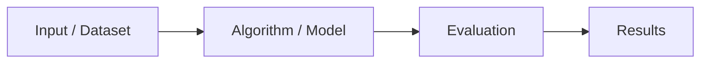

Got it 👍—you want a **clean, professional, and visually enhanced template** for reading and summarizing research papers, not project-specific.
Here’s the **refined and beautifully formatted version**, perfect for Obsidian, Notion, or a research log.
It includes **sub-sections for figures/tables**, placeholders for visual material, and consistent headings.

---

# 📚 Literature Review Template (Professional Academic Format)

---

## 🧭 1. **Bibliographic Information**

*(Always fill this section first — helps organize your Zotero, Notion, or Mendeley later)*

| Field                       | Entry                                           |
| :-------------------------- | :---------------------------------------------- |
| **Title:**                  |                                                 |
| **Authors & Affiliations:** |                                                 |
| **Year / Venue / DOI:**     |                                                 |
| **Keywords:**               |                                                 |
| **Field / Subfield:**       |                                                 |
| **Reference Type:**         | Journal / Conference / Workshop / Thesis / Book |

📘 **Figure / Table references**

* *Figure 1: Paper architecture overview*
* *Table 1: Dataset summary*
  *(Add more as you read — helps when citing visuals later.)*

---

## 🧩 2. **Research Context (Background)**

**2.1. Problem or Gap**

* What unsolved challenge or limitation does the paper address?
* Why does this gap exist in the literature?

**2.2. Importance / Motivation**

* Why is this topic important now?

  * 🧠 Scientific motivation
  * 🌍 Societal or industry relevance

**2.3. Related Work Summary**

* Who tackled this before, and how?
* Strengths and weaknesses of prior approaches.

**2.4. Limitations of Existing Work**

* Scalability? Cost? Assumptions? Missing benchmarks?

📊 **Figure Suggestion:** “State of the Art Landscape”

```
[Domain area diagram — showing prior work clusters and the gap this paper fills]
```

---

## 💡 3. **Research Question or Hypothesis**

**3.1. Central Question**

* What exact question does the paper answer?

**3.2. Objectives**

* What are the main goals or deliverables of this study?

**3.3. Hypotheses**

* Are there testable hypotheses (H1, H2, …)?

**3.4. Expected Outcomes**

* What would confirm or reject these hypotheses?

📉 *Table reference:* e.g., *Table 2: Hypotheses and Corresponding Metrics.*

---

## ⚙️ 4. **Methodology (Core of the Paper)**

**4.1. Framework / Model Overview**

* Describe the approach: algorithm, architecture, or theoretical model.

**4.2. Data / Simulation Environment**

* What datasets, simulators, or sources are used?
* Key assumptions or constraints?

**4.3. Variables**

| Variable     | Type | Description |
| ------------ | ---- | ----------- |
| Input(s)     |      |             |
| Parameter(s) |      |             |
| Output(s)    |      |             |

**4.4. Evaluation Metrics**

* Accuracy, precision, recall, F1-score, latency, coverage, etc.

**4.5. Tools / Software / Hardware**

* What platforms and tools were used (e.g., Python, MATLAB, ROS, GPUs)?

📈 **Figure Suggestion:** “Methodology Flowchart”



---

## 🧠 5. **Key Contributions**

*(Summarize in bullet points the novel ideas claimed by the authors.)*

* 🧩 C1:
* ⚙️ C2:
* 📊 C3:
* 💡 C4 (if any):

📷 *Figure reference:* *Figure 3: Overview of proposed architecture.*

---

## 📈 6. **Results and Analysis**

**6.1. Summary of Findings**

* Highlight key numerical or qualitative outcomes.

**6.2. Comparative Evaluation**

|  Metric | Proposed | Baseline | Δ (%) | Notes |
| ------: | -------: | -------: | ----: | ----- |
| Example |     0.89 |     0.75 | +18.7 | —     |

**6.3. Interpretation of Results**

* What do these results *mean* in context?
* Are differences practically significant?

**6.4. Limitations & Biases**

* Mention any dataset bias, overfitting, or scalability issues.

📊 **Figure Suggestion:** “Performance Comparison Chart”

```
[Graph Placeholder – x-axis: Baseline Methods, y-axis: Accuracy/Metric]
```

---

## 🔍 7. **Discussion / Insights**

**7.1. Field Advancement**

* How does this work move the research frontier forward?

**7.2. Broader Implications**

* Theoretical, practical, or ethical consequences.

**7.3. Unexpected Observations**

* Any contradictions or counterintuitive findings.

**7.4. Connections to Other Domains**

* Could this approach inspire progress in another field?

🧭 *Figure reference:* *Figure 4: Conceptual relationship diagram.*

---

## 🧾 8. **Critical Evaluation (Your Review)**

**8.1. Rating (1–5)**

| Criterion              | Score | Comment |
| ---------------------- | :---: | ------- |
| Novelty                |       |         |
| Technical Soundness    |       |         |
| Clarity / Organization |       |         |
| Experimental Rigor     |       |         |
| Reproducibility        |       |         |
| Impact / Applicability |       |         |
| Overall Impression     |       |         |

**8.2. Strengths**

* S1:
* S2:

**8.3. Weaknesses / Threats to Validity**

* W1:
* W2:

📘 **Figure Reference:** “Table 4: Strengths vs Weaknesses Summary.”

---

## 🚀 9. **Key Takeaways & Future Directions**

**9.1. Top 3 Insights**
1.
2.
3.

**9.2. Lessons Learned**

* What you personally learned or could apply elsewhere.

**9.3. Future Work / Open Questions**

* What remains unsolved?
* What could be improved or generalized?

**9.4. Ideas Sparked for Further Reading or Projects**

* Add references or keywords for exploration.

📈 **Figure Suggestion:** “Future Research Roadmap”

```
Idea → Gap → Next Study → Application
```

---

### 🗂️ At-a-Glance Summary Card

| Field                    | Entry |
| :----------------------- | :---- |
| Core Topic               |       |
| Study Type               |       |
| Data / Environment       |       |
| Key Metric               |       |
| Best Result              |       |
| Code/Data Availability   |       |
| Citable Summary Sentence |       |

---
