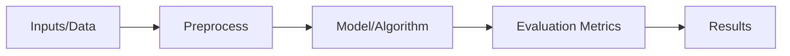
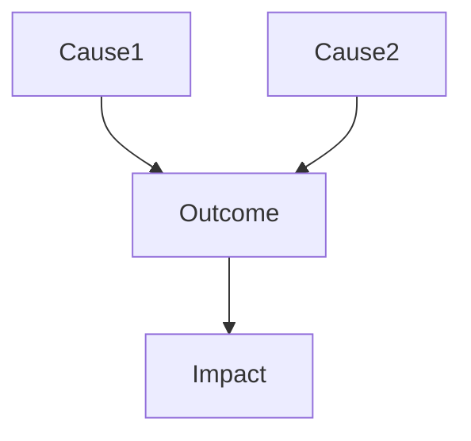

# 📚 Literature Review — Per-Paper Template (General, Domain-Agnostic)
_Last updated: 2025-10-06_

> **How to use**: Duplicate this file per paper. Keep answers concise but complete.
> Suggested workflow: **Pass 1 (skim)** → **Pass 2 (method/results)** → **Pass 3 (replication & synthesis)**.

---

## 🧭 1) Bibliographic Information
- **Title:** 
- **Authors & Affiliations:** 
- **Year / Venue / DOI:** 
- **URL(s):** Publisher / arXiv / Code / Dataset
- **Keywords (5–10):** 
- **Field / Subfield:** 
- **Reference key (BibTeX/ID):** 

> **Tagging tip:** Add 3–5 thematic tags you’ll re-use across papers (e.g., *task allocation*, *causal inference*, *privacy*, *optimization*).

---

## 🧩 2) Research Context (Background)
**Problem / Gap**
- What gap does the paper address? Why does it matter?
- Prior state-of-the-art: who did *what* before (2–4 key citations)?

**Motivation / Significance**
- Why now? Practical or theoretical urgency? Stakeholders?

**Limitations of existing work**
- Summarize common weaknesses (scalability, assumptions, data bias, reproducibility, etc.).

> **Cluster note:** Which theme(s) does this paper belong to for your review? (e.g., *planning*, *optimization*, *evaluation*).

**(Optional figure: Context map)**
```
[Domain Landscape Diagram Placeholder]
  Area A ──┬── Prior Work 1
           ├── Prior Work 2
           └── This Paper's Niche → (states contribution boundary)
```

---

## 💡 3) Research Question(s) or Hypotheses
- **Primary research question:** (one sentence, testable)
- **Secondary questions / objectives:** (bullets)
- **Explicit hypotheses (if any):** H1, H2, …
- **Success criteria:** What outcomes would *confirm* or *disconfirm* the claim?

> **Sanity check prompt:** If I had to test this in one sentence, what would I measure and compare?

---

## ⚙️ 4) Methodology (Core of the Paper)
**Study type** (theoretical / empirical / simulation / experimental / observational / qualitative / mixed):  
**Design** (randomized, controlled, cross-sectional, longitudinal, case study, A/B, etc.):  

**Model / Framework**
- High-level description (algorithms, theory, pipeline)
- Key assumptions (data, independence, stationarity, rationality, etc.)
- Complexity or scalability notes (Big-O, parameters, resources)

**Data / Environment**
- Data source(s) / simulator(s) / setting(s)
- Sampling strategy & inclusion/exclusion criteria
- Preprocessing steps

**Variables & Measures**
- Inputs / Covariates:
- Outputs / Dependent variables:
- Confounders / Controls:

**Procedures / Interventions (if any)**
- Treatment(s), conditions, task protocols, instructions

**Evaluation Metrics**
- Primary metrics (with definitions)
- Secondary or diagnostic metrics
- Statistical tests (e.g., t-test, ANOVA, bootstrap), effect sizes, CIs, corrections

**Tools / Software / Hardware**
- Libraries / packages / versions
- Compute resources (CPU/GPU/RAM), time budget

**(Optional figure: Method diagram)**


---

## 🧠 5) Key Contributions (as claimed by the authors)
- C1: (e.g., novel algorithm / new theoretical result / new dataset / new benchmark / new application)
- C2: 
- C3: 
- (Mark **type**: Method / Empirical / Resource / Theory / System / Application)

> **Verification note:** Which sections/figures substantiate each claim? List figure/table numbers next to each contribution.

---

## 📈 6) Results and Analysis
**Main findings**
- Summarize the 2–4 most important quantitative/qualitative results.

**Comparisons**
- Baselines or prior methods used for comparison; fairness of setup.

**Statistical validity**
- Tests used, effect sizes, confidence intervals, variance reporting, ablations.

**Robustness / Sensitivity**
- Sensitivity to hyperparameters, dataset shifts, missing data, outliers.

**Limitations (from results)**
- Failure modes, edge cases, unexpected behaviors.

**(Optional table: Key numbers)**
| Metric | Proposed | Best Baseline | Δ (abs) | Δ (%) | Notes |
|---|---:|---:|---:|---:|---|
| Example metric | 0.842 | 0.793 | +0.049 | +6.2 | … |

**(Optional figure: Recreate main chart idea)**
```
[Insert Figure Placeholder: e.g., Performance vs. Data Size]
x-axis: data size; y-axis: accuracy; lines: methods
```

---

## 🔍 7) Discussion / Interpretation
- What do the results *mean*? Practical significance vs. statistical significance.
- Competing explanations? Alternative hypotheses?
- Internal validity (method soundness), construct validity (metrics fit), external validity (generalizability).
- Ethical, legal, or societal implications.
- How does this shift the current consensus or open new questions?

**(Optional figure: Causal or conceptual map)**


---

## 🧩 8) Connections & Positioning in the Literature
- How does this paper relate to 3–6 closest works? Agreement/disagreement?
- Which gap does it still leave open?
- How will you **cite** this paper in your own review (1–2 sentences, neutral tone)?
- Keywords you’ll use to cluster this with others.

> **Synthesis anchor:** One sentence placing it on your review map (e.g., “bridges X and Y by doing Z”).

---

## 🧾 9) Critical Appraisal (Your Review)
**Scores (1–5)**
- Novelty: []
- Rigor / Soundness: []
- Clarity / Organization: []
- Reproducibility / Transparency: []
- Impact / Significance: []
- Ethics / Safety: []
- Writing / Presentation: []

**Strengths**
- S1:
- S2:

**Weaknesses / Threats to validity**
- W1:
- W2:

**Replicability checklist**
- [ ] Code link & license
- [ ] Data availability or synthetic generator
- [ ] Configs / seeds / full hyperparameters
- [ ] Environment description (versions)
- [ ] Exact steps to reproduce main tables/figures

---

## 🚀 10) Key Takeaways & Next Actions
- **One-sentence takeaway:** 
- **Top 3 insights:** 1) … 2) … 3) …
- **Open questions for future work:** 
- **Follow-up actions:** (replicate a figure, test a component, add to review section X)
- **Quotable lines (≤2):**

**(Optional figure: “So-what” diagram)**
```
Finding → Implication → Actionable next step
```

---

## 📎 Appendix (optional but useful)
- **Verbatim notes** (copy brief quotes or equations; keep under fair use)
- **Terminology / Symbols** (glossary)
- **Errata & author responses** (if any)
- **Personal reminders** (what to re-check later)

---

## 🗂️ At-a-glance Card (for literature matrix)
| Field | Entry |
|------|------|
| Core Topic |  |
| Study Type |  |
| Method Family |  |
| Data/Env |  |
| Primary Metric |  |
| Best Result |  |
| Code/Data? |  |
| Citable Sentence |  |

